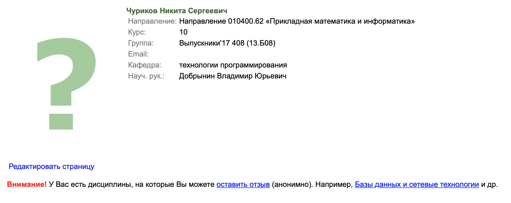
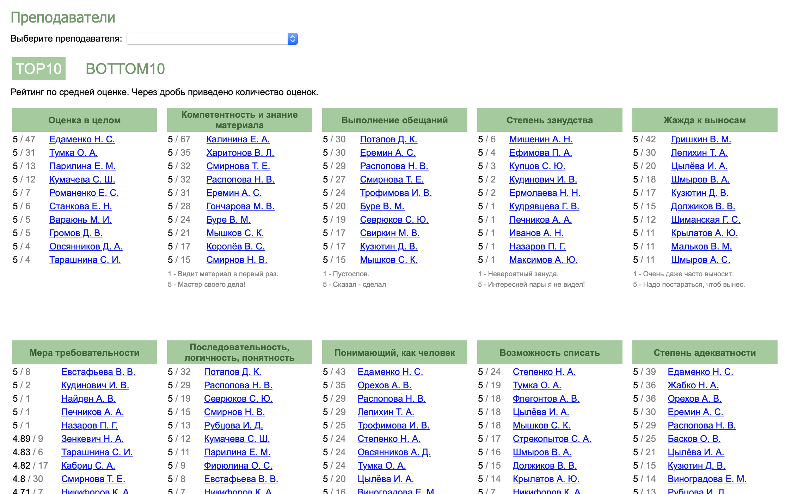
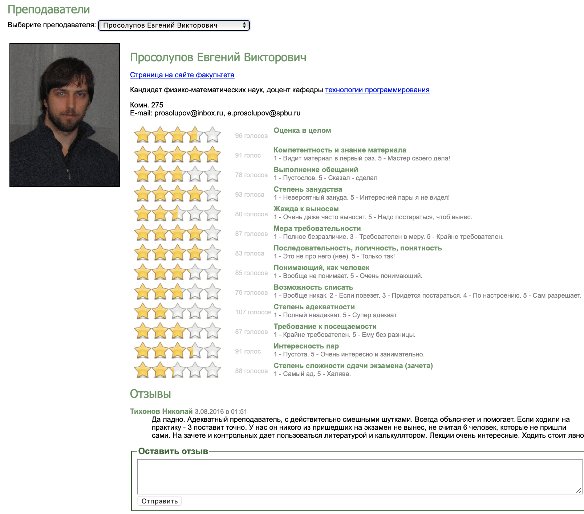
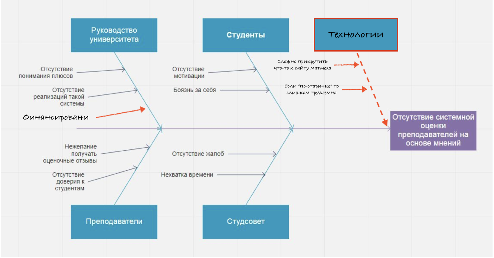

# Заключение по инновации: Создание системы отзывов о преподавателях для ректората

## Актуальность инновации;

Факультету, студентам и преподавателям матмеха действительно необходима система оценки преподавателей на основе мнений студентов. Автор рецензии имел опыт использования такой системы, созданной на официальном уровне на факультете прикладной математики. Там, эта система показала себя крайне эффективно, особенно когда ты новый студент, и ты не знаешь о преподавателях факультета ровным счетом ничего.

Потому, когда автор совершил переход с ПМПУ на МатМех, ему очень не хватало такого рейтинга, поскольку он помогает с выбором научного руководителя, курсов по выбору и поддерживает морально (или уничтожает) перед экзаменами.

## Полнота анализа причин проблемы;

### Анализ причин

Для анализа причин отсутствия подобной системы приведена [диаграмма Исикавы](https://ru.wikipedia.org/wiki/Диаграмма_Исикавы). Автору кажется, что на диаграмме отражены основные причины отсутствия подобной системы, однако можно добавить, что помимо перечисленных, можно добавить еще несколько причин.

### Необходимость действий

Мы согласны с перечисленными причинами необходимости безотлагательных действий.

## Оценка правильности команды изменений и оппозиции;

В целом, мы согласны с коалицией и оппозицией. Действительно, среди руководства найдутся как сторонники данной инновации, так и противники. Однако было бы интересно узнать почему может произойти раскол в руководстве по данному вопросу.

Также, если эту систему создавать исключительно для ректората, то у студентов не будет практически никакой мотивации писать отзывы. В лучшем случае проставят оценки, если там не надо будет писать текст.

## Оценка анализа рисков;

Мы считаем, что риски описаны практически все. Хочется только добавить, политический риск, который является следствием волны увольнений. Массовые увольнения могут привлечь негативное внимание высшего руководства и сми. Возможно, руководство факультета не хочет этого. Контрмера -- это использование результатов оценки преподавателя для проведения бесед с деканом, с целью выяснить видение преподавателя, почему его плохо оценивают студенты.

## Оценка правильности мероприятий. Помогут ли они достичь результата?

Еще можно проанализировать то, какие есть реализации у других факультетов и сторонних сервисов, чтобы понять, из чего составлять оценку преподавателя. Мы также не совсем понимаем смысл в проведении конференции, если можно обсудить все на факультете, если надо собраться физически или ограничиться электронными опросами. В остальном, план выглядит корректно.

## Оценка оправданности сметы;

Если проводить конференцию на самом факультете, то, наверно, за аренду платить не надо. В остальном, смета выглядит корректно.

## Оценка способов закрепления результатов преобразований.

Помимо перечисленного, можно еще пригласить выпускников оставить свои оценки и отзывы, чтобы за первый семестр приблизиться к средней оценке преподавателя. Еще мы думаем, что можно оценивать то, как меняются оценки преподавателя в среднем со временем. Таким образом можно определять улучшения или ухудшения в работе.

Однако мы считаем, что отзывы -- это всего лишь "звоночек", что что-то наладится, потому следует сначала проводить личные беседы с преподавателем, а потом уже делать официальные решения.
