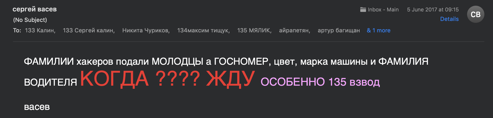

# Обновление системы донесения организационной информации до студентов и преподавателей матмеха.

## Проблема, которую решает инновация
На текущий момент существует несколько официальных вариантов, как донести организационную информацию до студентов и преподавателей матмеха:
- Сайт матмеха;
- Размещение объявлений на "Баобабе"
- Рассылка сообщений по почте.

Однако, несмотря на то, что все это звучит в пределах нормы качества, мы хотим показать, в каком виде информация доходит до участников образовательного процесса:

Письмо от учебного отдела

Письмо с военной кафедры

В целом, с данными письмами все нормально, информация донесена и для ее получения нет необходимости ехать в Петергоф.

Однако много организационной информации проходит мимо студентов. Примерами может быть:
- Появление расписания зачетов, экзаменов, учебных дисциплин сначала на баобабе, а потом на timetable.spbu.ru
- Информация о замене или отмены пар доносится в индивидуальном порядке преподавателем
<!-- TODO: Добавь больше -->

При этом, существуют и другие, неофициальные каналы, например информационный комитет Матмеха, который создан студентами и организует распространение новостей на добровольной основе. Это значит, что существует риск, что все члены комитета в один миг уйдут и канал передачи информации будет нарушен.

Таким образом данная инновация предлагает решение проблемы отсутствия современных, профессиональных и качественных каналов донесения информации.

## Анализ причин, которые привели к проблеме (диаграмма Исикавы)

<!-- 2.2.4. В случае противоречий между расписанием учебных занятий, размещенным на соответствующем информационном стенде СПбГУ, и расписанием учебных занятий, размещенным на сайте Университета, приоритет имеет расписание учебных занятий, размещенное на сайте Университета. -->

<!-- 2.2.10. В случае внесения изменений в расписание учебных занятий необходимо в тот же рабочий день уведомить об этом студентов и преподавателей путем размещения измененного расписания с отметкой об изменении или объявления о временном изменении части расписания на соответствующем информационном стенде СПбГУ и на сайте Университета. Сотрудник, отвечающий за составление расписания, обязан своевременно уведомить преподавателя об изменениях в расписании учебных занятий путём направления соответствующей информации по корпоративной электронной почте. -->

<!-- 4.3.10. Результаты промежуточной аттестации должны быть перенесены сотрудникам Учебного отдела из зачетных, экзаменационных, аттестационных ведомостей и протоколов заседания аттестационных комиссий в учебные карточки студентов и иные предусмотренные локальными актами Университета документы не позднее трех рабочих дней после сдачи преподавателем ведомости сотрудникам Учебного отдела. -->

## Объяснения необходимости безотлагательных действий

## Формирование коалиции (команды изменений), описание оппозиции (антагонистов)

## Формулировка видения изменений

## Анализ рисков и устранение препятствий на пути внедрения инновации

## Укрупненный план мероприятий внедрения инновации

## Смета и длительность инновационного проекта

## Способы закрепления результатов преобразований

## Институционализация инновации.

## Литература

1. [Правила обучения в СПБГУ](https://spbu.ru/sites/default/files/rules_study.pdf)
